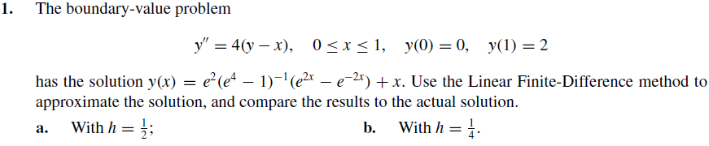
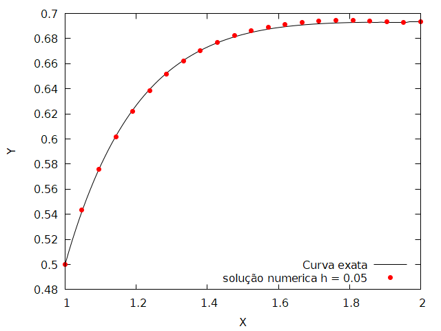

# problemas_contorno

  Em matemática, no ramo de equações diferenciais, um problema de valor sobre o contorno é um sistema de equações diferenciais provido de um conjunto de restrições adicionais, as chamadas condições de contorno ou condições de fronteira. Uma solução para um problema de valor sobre o contorno é a solução do sistema de equações diferenciais que satisfaz as condições de contorno.

# Shooting Linear

  Considere o problema de valor de contorno, que desejamos encontrar a solução numérica no intervalo [a,b],

> y" = p(x)y' + q(x)y + r(x) , x ∈ ]a,b]  
> y(a) = α  
> y(b) = β  


  Se p(x) e q(x) e r(x) são continuas em [a,b] e se q(x) > 0 para todo x ∈ [a,b] então o (PVF) acima tem uma unica solução

  O método do shooting consiste em tomar dois problemas de valor inicial (PVI) associados ao (PVF)
os dois PVIs são dados por

>> (PVI_1)  
> y" = p(x)y' + q(x)y + r(x) , x ∈ ]a,b]  
> y(a) = α  
> y'(a) = 0  

e  

>> (PVI_2)  
> y" = p(x)y' + q(x)y + r(x) , x ∈ ]a,b]  
> y(a) = 0  
> y'(a) = 1

  Note que nestes problemas, as equações são as mesmas, mas as condições iniciais são diferentes.
Os problemas (PVI_1) e (PVI_2) possuem cada um uma unica solução. Sejam y_1(x) a solução de (PVI-1)
e y_2(x) a solução de (PVI_2).
Uma conta fácil mostra que    

  
  e solução do (PVF). Como a sua solução é unica, então está é a solução do (PVF).
Assim, o método do shooting é baseado na substituição do (PVF) por dois problemas de valor inicial
(PVI-1) e (PVI-2). Sabemos resolver numericamnte os dois problemas e neste trabalho usamos os Métodos de Runge-Kutta.

## Codigo

``` c
double p(double x) //y'
{
  return 0;
}

double q(double x)//y
{
  return 4;
}

double r(double x)//x
{
  return -4*x;
}

double shootingLinear(char *filename,double a, double b,int n,double alfa,double beta)
{
  FILE *arq = fopen(filename,"w");
  double h,x;
  ///runge-kutta chute 1
  double k1[TAM],k2[TAM],k3[TAM],k4[TAM];
  ///runge-kutta chute 2
  double dk1[TAM],dk2[TAM],dk3[TAM],dk4[TAM];
  ///u e v
  double *u1 = (double*)malloc(n * sizeof(double)),
          *u2= (double*)malloc(n * sizeof(double)),
          *v1= (double*)malloc(n * sizeof(double)),
          *v2= (double*)malloc(n * sizeof(double));
  double _w1,_w2,w1,w2;
  int i;

  h = (b - a)/(double)n;
  u1[0] = alfa;
  u2[0] = 0;
  v1[0] = 0;
  v2[0] = 1;

  ///runge-kutta
  for(i = 0; i <= n - 1; i++)
  {
      x = a + i*h;
      k1[0] = h*u2[i];
      k1[1] = h*(p(x)*u2[i] + q(x)*u1[i]+r(x));
      k2[0] = h*(u2[i] + 0.5*k1[1]);
      k2[1] = h*(p(x+h/2.0)*(u2[i] + 0.5*k1[1]) + q(x+h/2.0)*(u1[i]+0.5*k1[0])+r(x+h/2.0));
      k3[0] = h*(u2[i]+0.5*k2[1]);
      k3[1] = h*(p(x+h/2.0)*(u2[i]+0.5*k2[1]) + q(x+h/2.0)*(u1[i]+0.5*k2[0])+r(x+h/2.0));
      k4[0] = h*(u2[i]+k3[1]);
      k4[1] = h*(p(x+h)*(u2[i]+k3[1]) + q(x+h)*(u1[i]+k3[0])+r(x+h));
      u1[i+1] = u1[i] + (1/6.0)*(k1[0]+2*k2[0]+2*k3[0]+k4[0]);
      u2[i+1] = u2[i] + (1/6.0)*(k1[1]+2*k2[1]+2*k3[1]+k4[1]);

      dk1[0] = h*v2[i];
      dk1[1] = h*(p(x)*v2[i] + q(x)*v1[i]);
      dk2[0] = h*(v2[i] + 0.5*dk1[1]);
      dk2[1] = h*(p(x+h/2.0)*(v2[i]+0.5*dk1[1])+q(x+h/2.0)*(v1[i] + 0.5*dk1[0]));
      dk3[0] = h*(v2[i] + 0.5*dk2[1]);
      dk3[1] = h*(p(x+h/2.0)*(v2[i]+0.5*dk2[1])+q(x+h/2.0)*(v1[i] + 0.5*dk2[0]));
      dk4[0] = h*(v2[i] + dk3[1]);
      dk4[1] = h*(p(x+h)*(v2[i]+dk3[1])+q(x+h)*(v1[i] + dk3[0]));

      v1[i+1] = v1[i] + (1/6.0)*(dk1[0]+2*dk2[0]+2*dk3[0]+dk4[0]);
      v2[i+1] = v2[i] + (1/6.0)*(dk1[1]+2*dk2[1]+2*dk3[1]+dk4[1]);
  }

  ///shooting linear
  _w1 = alfa;
  _w2 = (beta - u1[n])/(double)v1[n];

  puts("x_i \t u_i \t v_i \t w1 \t w2");
  printf("%lf,%lf,%lf,%lf,%lf\n",a,u1[0],v1[0],_w1,_w2);
  fprintf(arq,"%lf\t%lf\t%lf\n",a,_w1,_w2);

  for(i = 1; i <= n;i++)
  {
      w1 = u1[i]+_w2*v1[i];
      w2 = u2[i]+_w2*v2[i];
      x = a + i*h;

      printf("%lf,%lf,%lf,%lf,%lf\n",x,u1[i],v1[i],w1,w2);
      fprintf(arq,"%lf\t%lf\t%lf\n",x,w1,w2);
  }

  fclose(arq);
  return 0;
}
```

# Método das diferenças finitas

O método das diferenças finitas (MDF) é um método de resolução de equações diferenciais que se baseia na aproximação de derivadas por diferenças finitas. A fórmula de aproximação obtém-se da série de Taylor da função derivada. Atualmente, os MDFs são a abordagem dominante das soluções numéricas de equações diferenciais parciais.

Uma diferença finita é uma expressão da forma f(x + b) - f(x + a), que ao ser dividida por (b - a) chama-se um quociente de diferenças. A técnica de diferenças finitas consiste em aproximar a derivada de uma função via fórmulas discretas que requerem apenas um conjunto finito de pares ordenados xi,yi i=1n, onde geralmente denotamos yi = f(xi).
Essas fórmulas podem ser obtidas de várias maneiras. Começamos com a fórmula mais simples que pode ser obtida do cálculo diferencial. Seja f uma função diferenciável, a derivada de f no ponto x0 é, por definição,

f′(x 0) = lim h→0f(x0 + h) - f(x0) h .

Deste limite, tomando h≠0 pequeno (não muito pequeno para evitar o cancelamento catastrófico), é esperado que possamos obter uma aproximação razoável para f′(x 0). Assim, a diferença finita progressiva de ordem 1

D+,hf(x0) := f(x0 + h) - f(x0) h ≈ f′(x 0)

é uma aproximação para f′(x 0).

## Codigo

``` c
#include <stdio.h>
#include <stdlib.h>
#include <linalg.h>

#define N 4
#define DEBUG 1

double p(double x)
{
    return 0;
}

double q(double x)
{
    return 4;
}

double r(double x)
{
    return -4*x;
}

int main()
{

	FILE *arq = fopen("dados1.txt","w+");
    double a = 0, alpha = 0, b = 1,beta = 2; //condições de contorno
    double h;
    double x;
    double **A, *w ;
    int i;

    h = (b - a)/(double)(N + 1);

    A = (double**)malloc(N * sizeof(double*));

    for(i = 0; i < N;i++)
    {
        A[i] = (double*)malloc((N + 1) * sizeof(double));
    }

	//inicializa valores comuns na matriz
    for(i = 1;i < N - 1; i++)
    {
        x = a + i*h;
		A[i][i+1] = -1 + h/2.0*p(x); // inicializa a diagonal superior
        A[i][i] = 2 + h * h* q(x); // inicializa a diagonal principal
		A[i][i-1] = -1 - h/2.0*p(x); // inicializa a diagonal inferior
    }

	//inicializa a diagonal principal
	A[0][0] = 2 + h * h* q(a);  // (ponto superior fora do laço)
	A[N - 1][N - 1] = 2 + h * h* q(a + (N - 1)*h); //(ponto inferior fora do laço)

	// inicializa a diagonal superior (ponto superior fora do laço)
	A[0][1] = -1 + h/2.0*p(a);

	// inicializa a diagonal inferior (ponto inferior fora do laço)
	A[N - 1][N - 2] = -1 - h/2.0*p(a + (N - 2)*h);

    //linha aumentada

    A[0][N] = -h*h*r(a + h) + (1 + h/2.0*p(a + h))*alpha;
    A[N - 1][N] = -h*h*r(a + N*h) + (1 - h/2.0*p(a + N*h))*beta;

    for(i = 1; i < N - 1; i++)
    {
        A[i][N] = -h*h*r(a + (i + 1)*h);

		#if DEBUG
		printf("%d,%lf\n",i,r(a + (i + 1)*h));
		#endif //DEBUG
    }

    imprimeMatriz(A,N,N+1);
	w = metodoJacobi(A,N,0);

	puts("resultado:");
	fprintf(arq,"%lf\t%lf\n",a ,alpha);
	for(i = 0; i < N; i++)
	{
		fprintf(arq,"%lf\t%lf\n",a + (i + 1)*h,w[i]);
		printf("%lf\t%lf\n",a + (i + 1)*h,w[i]);
	}
	fprintf(arq,"%lf\t%lf\n",b,beta);
	puts("\n");

	for(i = 0; i < N; i++)
	{
		free(A[i]);
	}

    return 0;
}
``` 

# Resolução dos exercicios do Burden 9 edição

## set 11.1

  
  
  

  
  
  

  
  

  
  
  

 
  
  

  
  

  
  
  
